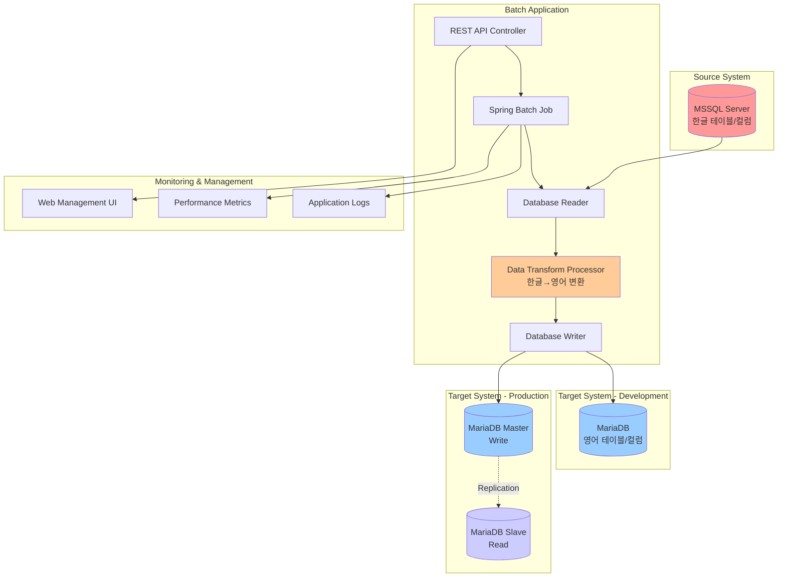
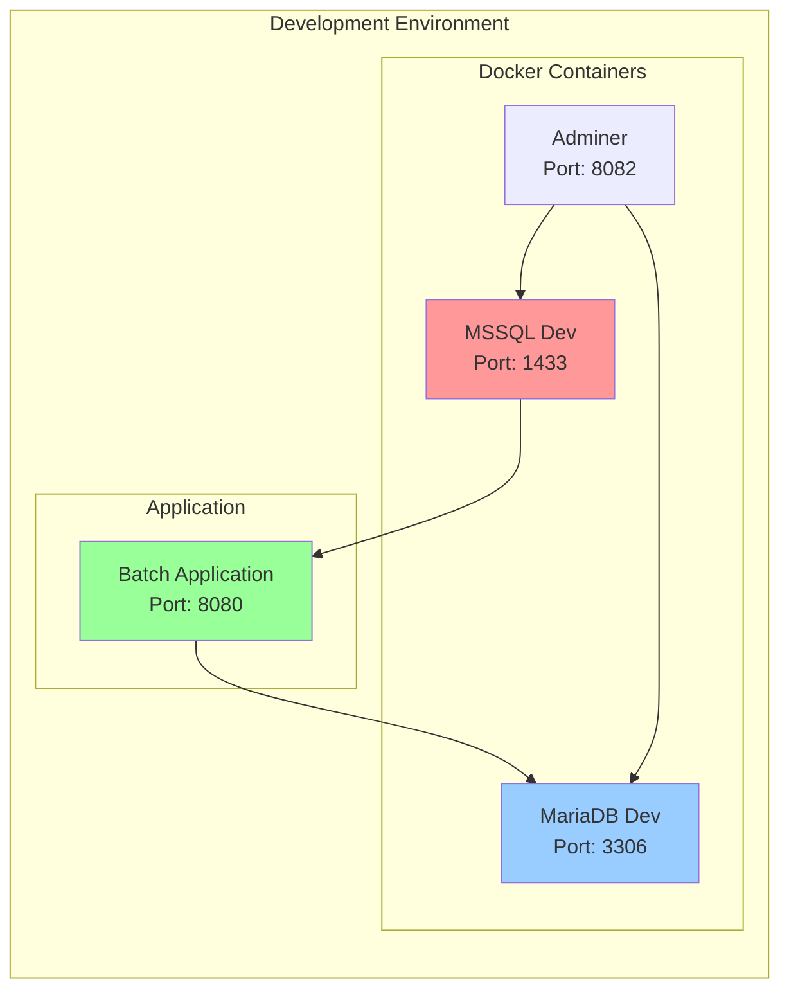
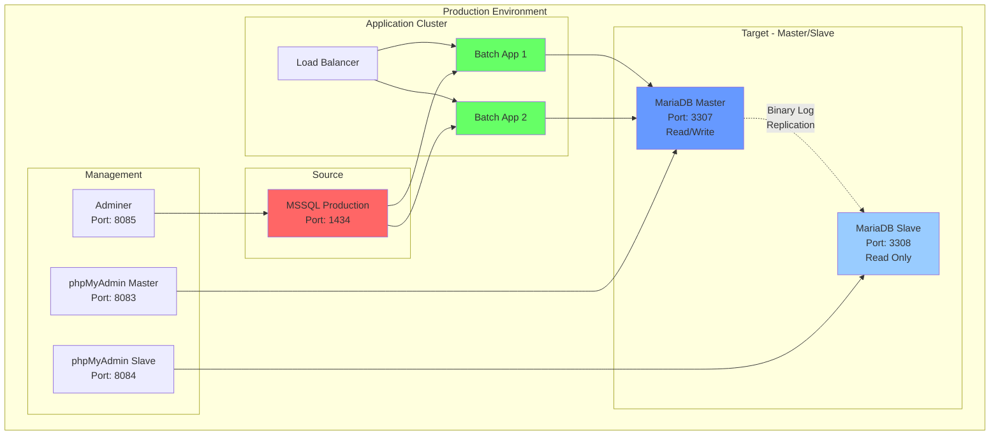
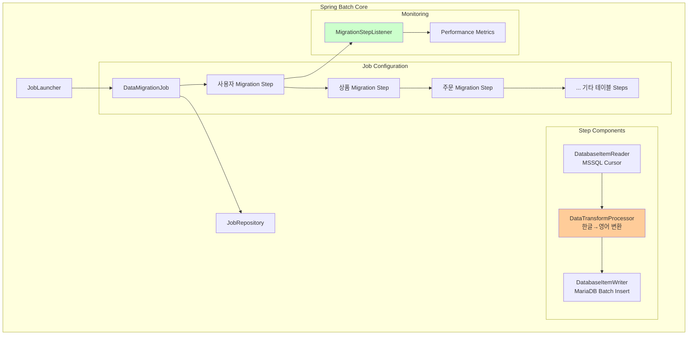
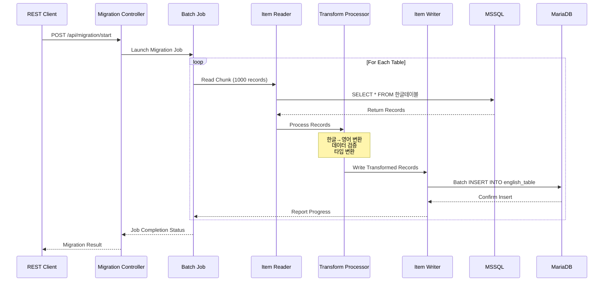
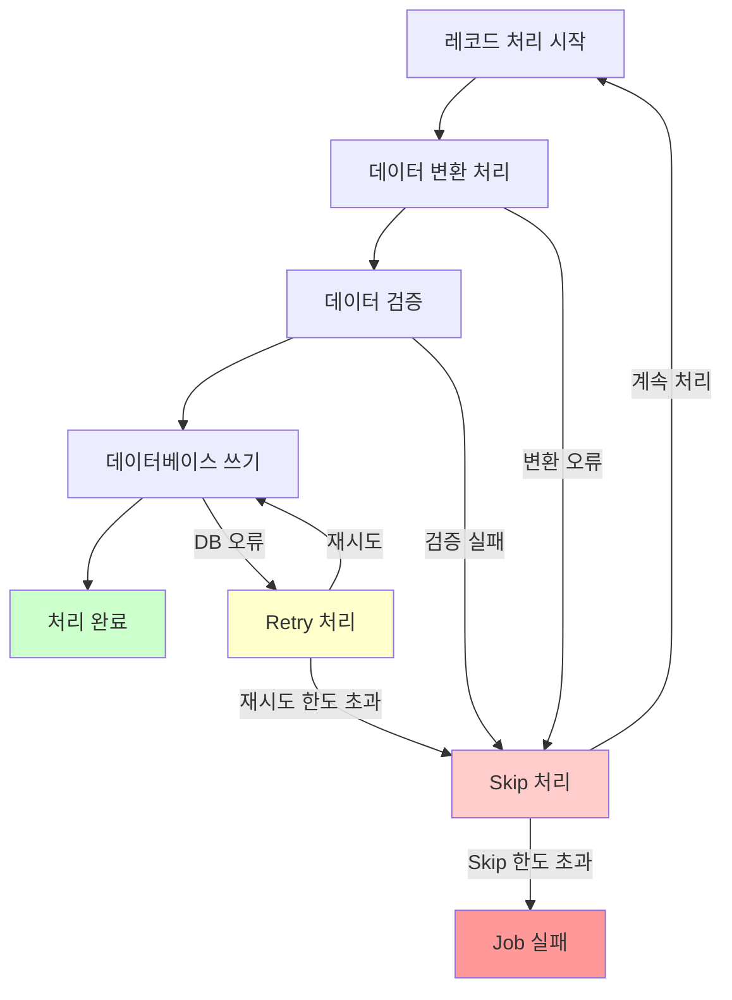
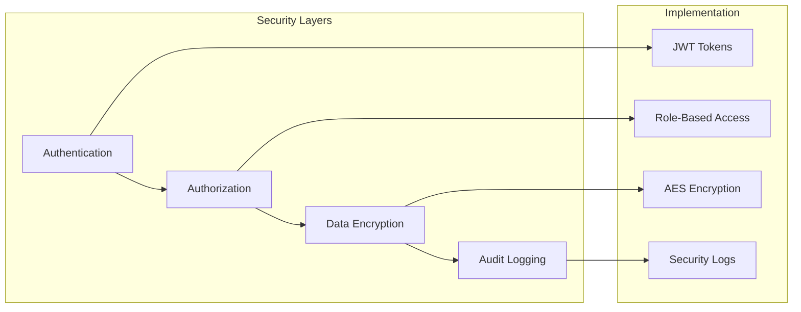
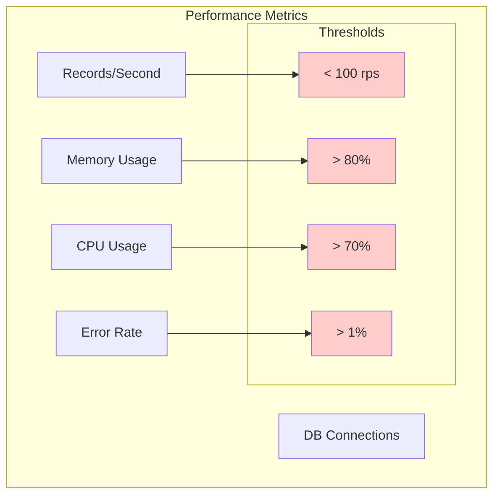

# MSSQL to MariaDB 데이터 이관 시스템 아키텍처

## 📋 목차
1. [시스템 개요](#시스템-개요)
2. [전체 아키텍처](#전체-아키텍처)
3. [환경별 구성](#환경별-구성)
4. [컴포넌트 상세](#컴포넌트-상세)
5. [데이터 플로우](#데이터-플로우)
6. [기술 스택](#기술-스택)
7. [보안 고려사항](#보안-고려사항)

## 🎯 시스템 개요

본 시스템은 **Spring Batch**를 기반으로 한 **MSSQL에서 MariaDB로의 데이터 이관 솔루션**입니다. 한글 테이블명과 컬럼명을 영어로 변환하면서 대용량 데이터를 안전하고 효율적으로 이관하는 것을 목표로 합니다.

### 주요 특징
- ✅ **청크 기반 처리**: 메모리 효율적인 대용량 데이터 처리
- ✅ **한글-영어 변환**: 테이블명, 컬럼명, 값의 자동 변환
- ✅ **환경별 설정**: 개발(1:1), 운영(Master-Slave) 환경 지원
- ✅ **실시간 모니터링**: REST API 기반 진행 상황 추적
- ✅ **오류 복구**: 재시도, 스킵, 롤백 메커니즘
- ✅ **Docker 기반**: 컨테이너화된 개발/테스트 환경

## 🏗️ 전체 아키텍처

## 🌍 환경별 구성

### 개발 환경 (Development)

| 컴포넌트 | 포트 | 용도 | 접속 정보 |
|---------|------|------|-----------|
| MSSQL Dev | 1433 | 소스 데이터베이스 | sa / DevPassword123! |
| MariaDB Dev | 3306 | 타겟 데이터베이스 | root / DevPassword123! |
| Adminer | 8082 | DB 관리 도구 | Web UI |
| Batch App | 8080 | 배치 애플리케이션 | REST API |

### 운영 환경 (Production)

| 환경 | 컴포넌트 | 포트 | 역할 | 고가용성 |
|------|---------|------|------|----------|
| 운영 | MSSQL Prod | 1434 | 소스 DB | Cluster |
| 운영 | MariaDB Master | 3307 | 타겟 DB (Write) | Master-Slave |
| 운영 | MariaDB Slave | 3308 | 타겟 DB (Read) | Replication |
| 운영 | Batch App | 8080 | 배치 처리 | Load Balanced |

## 🔧 컴포넌트 상세

### 1. Spring Batch 아키텍처

### 2. 데이터 변환 프로세서 상세

| 변환 유형 | 소스 (한글) | 타겟 (영어) | 예시 |
|-----------|-------------|-------------|------|
| **테이블명** | 사용자 | users | 사용자 → users |
| **테이블명** | 상품 | products | 상품 → products |
| **테이블명** | 주문 | orders | 주문 → orders |
| **컬럼명** | 사용자ID | user_id | 사용자ID → user_id |
| **컬럼명** | 이름 | name | 이름 → name |
| **컬럼명** | 주문상태 | order_status | 주문상태 → order_status |
| **값 변환** | 남성 | MALE | 성별: 남성 → MALE |
| **값 변환** | 배송완료 | DELIVERED | 주문상태: 배송완료 → DELIVERED |
| **값 변환** | 판매중 | ON_SALE | 판매상태: 판매중 → ON_SALE |

### 3. 배치 처리 설정

| 설정 항목 | 개발환경 | 운영환경 | 설명 |
|-----------|----------|----------|------|
| **Chunk Size** | 100-500 | 1000-5000 | 한 번에 처리할 레코드 수 |
| **Skip Limit** | 50 | 100-500 | 허용 가능한 오류 개수 |
| **Retry Limit** | 3 | 3-5 | 재시도 횟수 |
| **Connection Pool** | 5-10 | 20-50 | DB 연결 풀 크기 |
| **Thread Pool** | 2-4 | 8-16 | 병렬 처리 스레드 수 |

## 🔄 데이터 플로우

### 1. 전체 데이터 플로우

### 2. 오류 처리 플로우

## 💻 기술 스택

### Backend 기술 스택

| 계층 | 기술 | 버전 | 용도 |
|------|------|------|------|
| **Language** | Java | 17 | 메인 개발 언어 |
| **Framework** | Spring Boot | 3.3.5 | 애플리케이션 프레임워크 |
| **Batch** | Spring Batch | 5.x | 배치 처리 프레임워크 |
| **Build** | Gradle | 8.x | 빌드 도구 |
| **Database** | MSSQL Server | 2022 | 소스 데이터베이스 |
| **Database** | MariaDB | 11.2 | 타겟 데이터베이스 |
| **Connection Pool** | HikariCP | 5.1.0 | 데이터베이스 연결 풀 |
| **Testing** | JUnit 5 | 5.10.0 | 단위 테스트 |
| **Testing** | Mockito | 5.x | 모킹 프레임워크 |
| **Testing** | Testcontainers | 1.19.x | 통합 테스트 |

### Infrastructure 기술 스택

| 계층 | 기술 | 용도 |
|------|------|------|
| **Containerization** | Docker | 컨테이너화 |
| **Orchestration** | Docker Compose | 로컬 개발 환경 |
| **Database Management** | Adminer | DB 관리 도구 |
| **Database Management** | phpMyAdmin | MariaDB 전용 관리 |
| **Monitoring** | Spring Actuator | 애플리케이션 모니터링 |
| **Logging** | Logback | 로깅 프레임워크 |

### 개발 도구

| 도구 | 용도 |
|------|------|
| **IntelliJ IDEA** | 통합 개발 환경 |
| **Git** | 버전 관리 |
| **Postman** | API 테스트 |
| **DBeaver** | 데이터베이스 클라이언트 |

## 🔒 보안 고려사항

### 1. 데이터베이스 보안

| 보안 요소 | 구현 방법 | 설명 |
|-----------|-----------|------|
| **연결 암호화** | SSL/TLS | 데이터베이스 연결 암호화 |
| **인증** | 사용자/비밀번호 | 강력한 비밀번호 정책 |
| **권한 관리** | 최소 권한 원칙 | 필요한 권한만 부여 |
| **네트워크 격리** | Docker Network | 컨테이너 간 네트워크 분리 |

### 2. 애플리케이션 보안

### 3. 운영 보안 체크리스트

- [ ] **비밀번호 관리**: 환경변수 또는 Secret 관리 도구 사용
- [ ] **네트워크 보안**: 방화벽 설정 및 VPN 접근
- [ ] **로그 모니터링**: 보안 이벤트 실시간 모니터링
- [ ] **백업 암호화**: 데이터 백업 시 암호화 적용
- [ ] **접근 제어**: IP 화이트리스트 및 시간 기반 접근 제어
- [ ] **정기 보안 점검**: 취약점 스캔 및 보안 업데이트

## 📊 성능 최적화

### 1. 배치 성능 튜닝 가이드

| 항목 | 소량 데이터 | 중량 데이터 | 대량 데이터 |
|------|-------------|-------------|-------------|
| **Chunk Size** | 100-500 | 1000-2000 | 2000-5000 |
| **Thread Pool** | 2-4 | 4-8 | 8-16 |
| **Connection Pool** | 5-10 | 10-20 | 20-50 |
| **JVM Heap** | 1-2GB | 2-4GB | 4-8GB |
| **Fetch Size** | 100-500 | 500-1000 | 1000-2000 |

### 2. 모니터링 지표

이 아키텍처 문서는 시스템의 전체적인 구조와 각 컴포넌트의 역할, 그리고 운영 시 고려해야 할 사항들을 포괄적으로 다루고 있습니다. 개발팀과 운영팀이 시스템을 이해하고 효과적으로 관리할 수 있도록 도움을 제공합니다.
