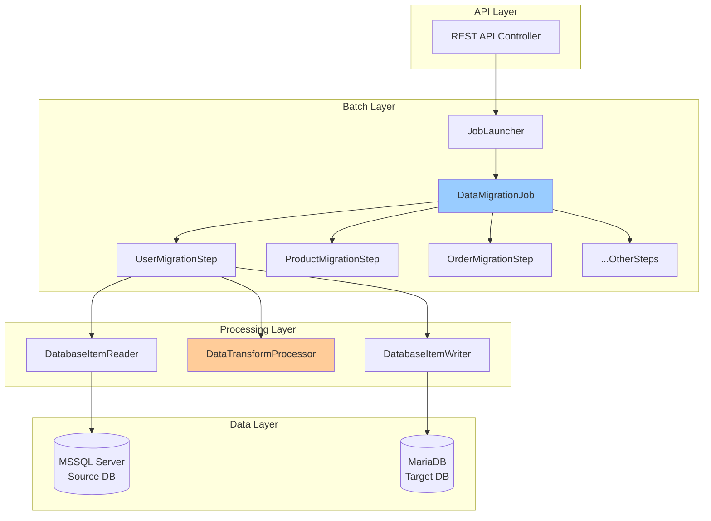
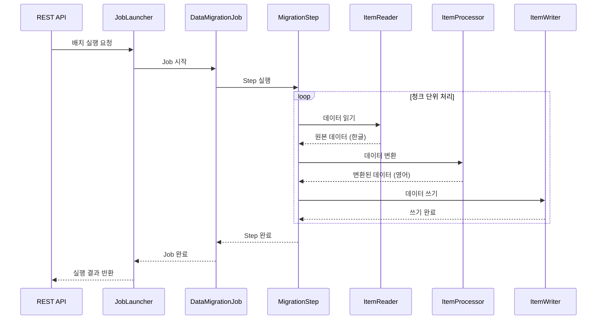

# Spring Batch 데이터 이관 배치 설계서

## 📋 문서 정보
- **프로젝트명**: MSSQL to MariaDB 데이터 이관 시스템
- **문서 버전**: v1.0
- **작성일**: 2024-07-16
- **작성자**: SI 개발팀
- **검토자**: 프로젝트 매니저

## 🎯 1. 배치 시스템 개요

### 1.1 시스템 목적
- MSSQL Server에서 MariaDB로 대용량 데이터 이관
- 한글 테이블명/컬럼명을 영어로 변환하여 이관
- 실시간 모니터링 및 오류 복구 기능 제공
- REST API를 통한 배치 작업 제어

### 1.2 기술 스택
| 구분 | 기술 | 버전 |
|------|------|------|
| Language | Java | 17 |
| Framework | Spring Boot | 3.3.5 |
| Batch | Spring Batch | 5.x |
| Build Tool | Gradle | 8.x |
| Source DB | MSSQL Server | 2022 |
| Target DB | MariaDB | 11.2 |

### 1.3 처리 규모
- **예상 데이터량**: 테이블당 최대 100만 건
- **총 테이블 수**: 10개
- **일일 처리량**: 전체 데이터 1회 이관
- **처리 시간**: 평균 30분 이내

## 🏗️ 2. 배치 아키텍처 설계

### 2.1 전체 시스템 구조



### 2.2 배치 처리 플로우



## 💼 3. Job 설계

### 3.1 Job 구성

#### 3.1.1 DataMigrationJob (전체 이관)
```java
@Configuration
public class DataMigrationJobConfig {
    
    @Bean
    public Job dataMigrationJob() {
        return jobBuilderFactory.get("dataMigrationJob")
            .incrementer(new RunIdIncrementer())
            .listener(jobExecutionListener())
            .start(userMigrationStep())           // 1. 사용자
            .next(categoryMigrationStep())        // 2. 카테고리
            .next(productMigrationStep())         // 3. 상품
            .next(orderMigrationStep())           // 4. 주문
            .next(orderDetailMigrationStep())     // 5. 주문상세
            .next(reviewMigrationStep())          // 6. 리뷰
            .next(noticeMigrationStep())          // 7. 공지사항
            .next(couponMigrationStep())          // 8. 쿠폰
            .next(deliveryMigrationStep())        // 9. 배송
            .next(inquiryMigrationStep())         // 10. 문의
            .build();
    }
}
```

#### 3.1.2 SingleTableJob (개별 테이블)
```java
public Job createSingleTableMigrationJob(String tableName, String whereClause) {
    return jobBuilderFactory.get("singleTableMigrationJob_" + tableName)
        .incrementer(new RunIdIncrementer())
        .start(createTableMigrationStep(tableName, whereClause))
        .build();
}
```

### 3.2 Job Parameters

| 파라미터명 | 타입 | 필수여부 | 기본값 | 설명 |
|-----------|------|----------|--------|------|
| startTime | LocalDateTime | Y | 현재시간 | 배치 시작 시간 |
| triggeredBy | String | Y | REST_API | 실행 주체 |
| chunkSize | Long | N | 1000 | 청크 처리 크기 |
| skipLimit | Long | N | 100 | 오류 허용 개수 |
| tableName | String | N | - | 단일 테이블명 |
| whereClause | String | N | - | 조건절 |

## 🔄 4. Step 설계

### 4.1 Step 구성 요소

#### 4.1.1 기본 Step 설정
```java
@Bean
public Step userMigrationStep() {
    return stepBuilderFactory.get("userMigrationStep")
        .<DataRecord, DataRecord>chunk(chunkSize)
        .reader(createDatabaseItemReader("사용자", null))
        .processor(dataTransformProcessor)
        .writer(databaseItemWriter)
        .faultTolerant()
        .skipLimit(skipLimit)
        .skip(DataAccessException.class)
        .retryLimit(3)
        .retry(TransientDataAccessException.class)
        .listener(migrationStepListener)
        .build();
}
```

#### 4.1.2 Step 처리 설정

| 설정 항목 | 개발환경 | 운영환경 | 설명 |
|-----------|----------|----------|------|
| Chunk Size | 100 | 1000-5000 | 한 번에 처리할 레코드 수 |
| Skip Limit | 10 | 100-500 | 허용 가능한 오류 개수 |
| Retry Limit | 3 | 3-5 | 재시도 횟수 |
| Transaction Timeout | 60초 | 300초 | 트랜잭션 타임아웃 |
| Thread Pool Size | 2 | 8-16 | 병렬 처리 스레드 수 |

### 4.2 오류 처리 전략

#### 4.2.1 Skip 대상 예외
- `DataAccessException`: 데이터베이스 접근 오류
- `ValidationException`: 데이터 검증 실패
- `DataConversionException`: 데이터 변환 오류
- `ConstraintViolationException`: 제약조건 위반

#### 4.2.2 Retry 대상 예외
- `TransientDataAccessException`: 일시적 DB 연결 오류
- `DeadlockLoserDataAccessException`: 데드락 발생
- `QueryTimeoutException`: 쿼리 타임아웃
- `ConnectionException`: 네트워크 연결 오류

## 📊 5. 데이터 처리 컴포넌트

### 5.1 DatabaseItemReader

#### 5.1.1 기능
- MSSQL에서 청크 단위로 데이터 읽기
- 커서 기반 처리로 메모리 효율성 확보
- 동적 SQL 생성 (WHERE 조건 지원)

#### 5.1.2 구현 예시
```java
@Component
public class DatabaseItemReader {
    
    public JdbcCursorItemReader<DataRecord> createReader(
            DataSource dataSource, 
            String tableName, 
            String whereClause, 
            int fetchSize) {
        
        String sql = buildSelectQuery(tableName, whereClause);
        
        return new JdbcCursorItemReaderBuilder<DataRecord>()
            .name(tableName + "ItemReader")
            .dataSource(dataSource)
            .sql(sql)
            .rowMapper(new DataRecordRowMapper(tableName))
            .fetchSize(fetchSize)
            .build();
    }
}
```

### 5.2 DataTransformProcessor

#### 5.2.1 변환 규칙

| 변환 유형 | 소스 (한글) | 타겟 (영어) | 예시 |
|-----------|-------------|-------------|------|
| 테이블명 | 사용자 | users | 사용자 → users |
| 테이블명 | 상품 | products | 상품 → products |
| 컬럼명 | 사용자ID | user_id | 사용자ID → user_id |
| 컬럼명 | 이름 | name | 이름 → name |
| 값 변환 | 남성 | MALE | 성별: 남성 → MALE |
| 값 변환 | 배송완료 | DELIVERED | 상태: 배송완료 → DELIVERED |

#### 5.2.2 처리 플로우
```java
@Override
public DataRecord process(DataRecord item) throws Exception {
    try {
        // 1. 데이터 검증
        validateData(item);
        
        // 2. 데이터 변환
        DataRecord transformedItem = transformData(item);
        
        // 3. 통계 업데이트
        updateProcessingStats();
        
        return transformedItem;
        
    } catch (Exception e) {
        logger.error("Processing failed for item: {}", item, e);
        errorCount++;
        throw e;
    }
}
```

### 5.3 DatabaseItemWriter

#### 5.3.1 기능
- MariaDB에 배치 INSERT 수행
- 트랜잭션 관리
- 오류 발생 시 개별 INSERT 재시도

#### 5.3.2 성능 최적화
```java
@Override
public void write(List<? extends DataRecord> items) throws Exception {
    Map<String, List<DataRecord>> groupedItems = groupByTable(items);
    
    for (Map.Entry<String, List<DataRecord>> entry : groupedItems.entrySet()) {
        String tableName = entry.getKey();
        List<DataRecord> records = entry.getValue();
        
        try {
            // 배치 INSERT 시도
            batchInsert(tableName, records);
            writtenCount += records.size();
            
        } catch (DataAccessException e) {
            // 개별 INSERT로 재시도
            individualInsert(tableName, records);
        }
    }
}
```

## 📈 6. 모니터링 및 로깅

### 6.1 실시간 모니터링

#### 6.1.1 Spring Actuator 메트릭
```yaml
management:
  endpoints:
    web:
      exposure:
        include: health,metrics,info,prometheus
  metrics:
    export:
      prometheus:
        enabled: true
```

#### 6.1.2 커스텀 메트릭
```java
@Component
public class BatchMetrics {
    
    @EventListener
    public void handleStepExecution(StepExecutionEvent event) {
        StepExecution stepExecution = event.getStepExecution();
        
        // 처리 속도 기록
        recordProcessingRate(stepExecution);
        
        // 오류율 기록
        recordErrorRate(stepExecution);
        
        // 메모리 사용량 기록
        recordMemoryUsage();
    }
}
```

### 6.2 로깅 전략

#### 6.2.1 로그 설정
```yaml
logging:
  level:
    com.example.batch: INFO
    org.springframework.batch: DEBUG
  pattern:
    file: "%d{yyyy-MM-dd HH:mm:ss.SSS} [%thread] %-5level [%X{jobName}:%X{stepName}] %logger{36} - %msg%n"
  file:
    name: logs/batch-migration.log
    max-size: 100MB
    max-history: 30
```

#### 6.2.2 구조화된 로깅
```java
@Component
public class MigrationStepListener implements StepExecutionListener {
    
    @Override
    public void beforeStep(StepExecution stepExecution) {
        MDC.put("jobName", stepExecution.getJobExecution().getJobInstance().getJobName());
        MDC.put("stepName", stepExecution.getStepName());
        
        logger.info("=== Step 시작: {} ===", stepExecution.getStepName());
        logger.info("Job Parameters: {}", stepExecution.getJobParameters());
    }
    
    @Override
    public ExitStatus afterStep(StepExecution stepExecution) {
        long duration = stepExecution.getEndTime().getTime() - stepExecution.getStartTime().getTime();
        
        logger.info("=== Step 완료: {} ===", stepExecution.getStepName());
        logger.info("처리 결과 - Read: {}, Write: {}, Skip: {}, 소요시간: {}ms",
            stepExecution.getReadCount(),
            stepExecution.getWriteCount(), 
            stepExecution.getSkipCount(),
            duration);
            
        MDC.clear();
        return stepExecution.getExitStatus();
    }
}
```

## ⚡ 7. 성능 최적화

### 7.1 청크 크기 최적화

| 데이터 규모 | 권장 청크 크기 | 예상 처리 시간 | 메모리 사용량 |
|-------------|----------------|----------------|---------------|
| 1만 건 이하 | 100-500 | 1-2분 | 낮음 |
| 10만 건 | 1000-2000 | 5-10분 | 보통 |
| 100만 건 | 2000-5000 | 20-30분 | 높음 |

### 7.2 데이터베이스 최적화

#### 7.2.1 Connection Pool 설정
```yaml
spring:
  datasource:
    source:
      hikari:
        maximum-pool-size: 20
        minimum-idle: 5
        connection-timeout: 30000
        idle-timeout: 600000
        leak-detection-threshold: 60000
    target:
      hikari:
        maximum-pool-size: 30
        minimum-idle: 10
        connection-timeout: 30000
        idle-timeout: 600000
```

#### 7.2.2 SQL 최적화
```sql
-- Reader SQL (페이징 처리)
SELECT * FROM 테이블명 
WHERE 조건절 
ORDER BY 기본키 
OFFSET ? ROWS FETCH NEXT ? ROWS ONLY

-- Writer SQL (배치 INSERT)
INSERT INTO target_table (col1, col2, col3, migrated_at) 
VALUES (?, ?, ?, CURRENT_TIMESTAMP),
       (?, ?, ?, CURRENT_TIMESTAMP),
       ...
```

### 7.3 JVM 튜닝

#### 7.3.1 개발환경
```bash
java -Xms512m -Xmx2g \
     -XX:+UseG1GC \
     -jar batch-migration.jar
```

#### 7.3.2 운영환경
```bash
java -Xms2g -Xmx8g \
     -XX:+UseG1GC \
     -XX:MaxGCPauseMillis=200 \
     -XX:+HeapDumpOnOutOfMemoryError \
     -XX:HeapDumpPath=/logs/heapdump \
     -jar batch-migration.jar
```

## 🚨 8. 예외 상황 및 대응 방안

### 8.1 예외 상황별 대응

| 예외 상황 | 원인 | 대응 방안 | 복구 방법 |
|-----------|------|-----------|-----------|
| OutOfMemoryError | 청크 크기 과다 | 청크 크기 감소 | 애플리케이션 재시작 |
| Connection Timeout | DB 연결 지연 | 타임아웃 증가 | 재시도 |
| Deadlock | 동시 접근 | 재시도 로직 | 자동 재시도 |
| Disk Full | 로그 파일 과다 | 로그 정리 | 디스크 공간 확보 |
| Data Validation Error | 잘못된 데이터 | Skip 처리 | 수동 데이터 수정 |

### 8.2 복구 절차

#### 8.2.1 Job 재시작
```bash
# 실패한 Job 재시작
curl -X POST "http://localhost:8080/api/migration/restart/{jobExecutionId}"

# 특정 Step부터 재시작
curl -X POST "http://localhost:8080/api/migration/restart/{jobExecutionId}?fromStep=productMigrationStep"
```

#### 8.2.2 데이터 정합성 검증
```sql
-- 소스와 타겟 레코드 수 비교
SELECT 
    'source' as db_type, 
    COUNT(*) as record_count 
FROM mssql_source.사용자
UNION ALL
SELECT 
    'target' as db_type, 
    COUNT(*) as record_count 
FROM mariadb_target.users;
```

이 배치 설계서는 SI 프로젝트에서 요구되는 기술적 상세사항과 운영 고려사항을 모두 포함하고 있습니다.
