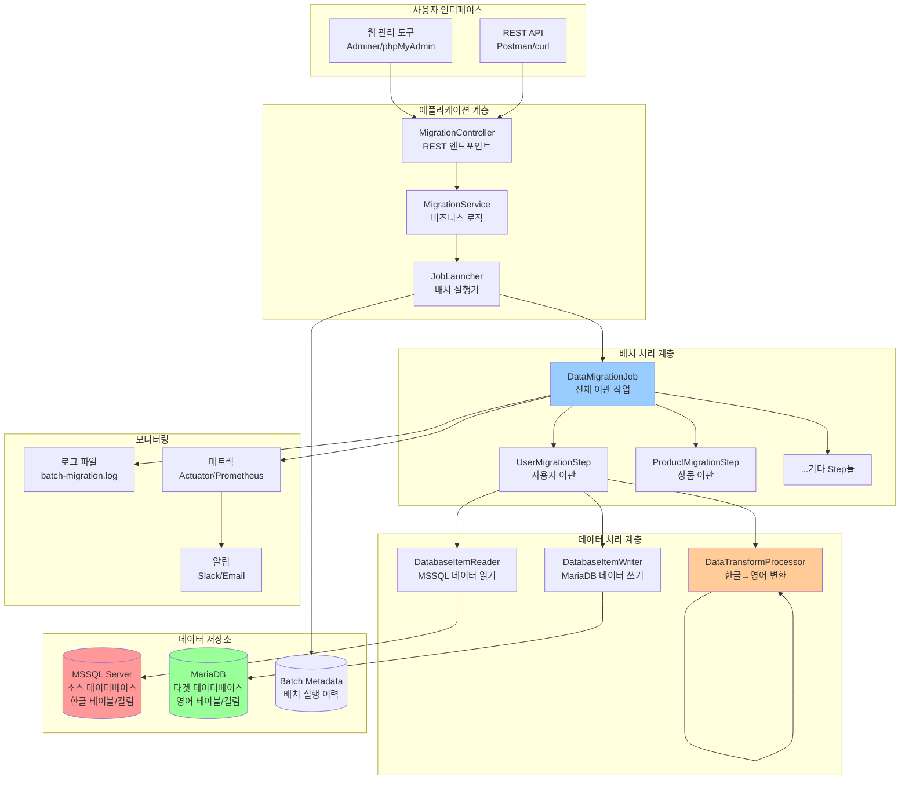
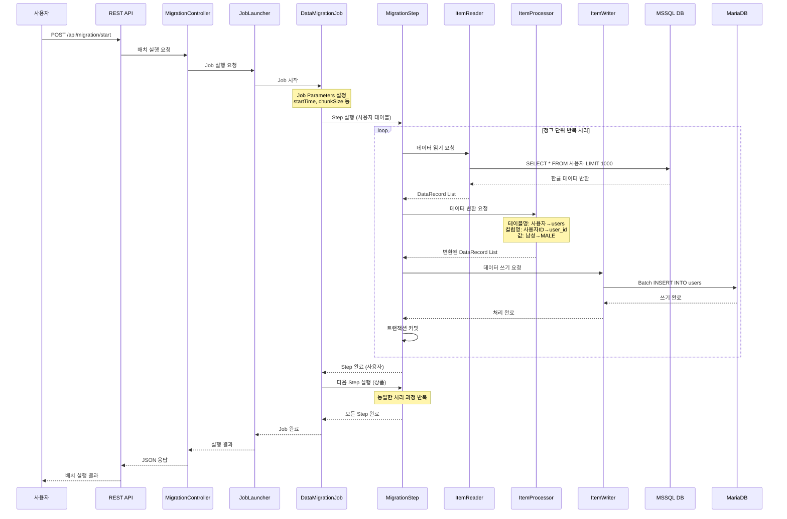
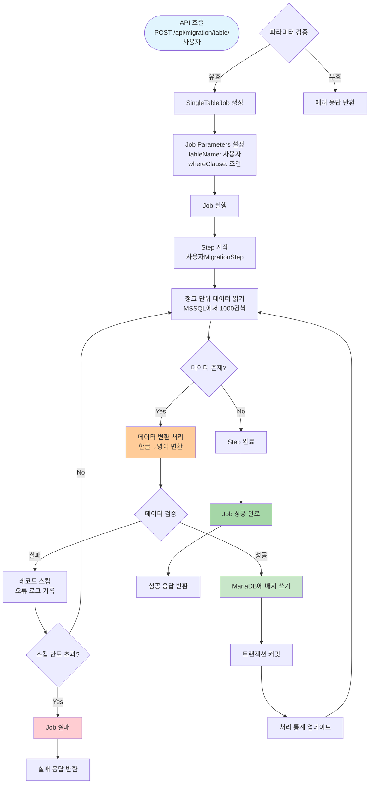
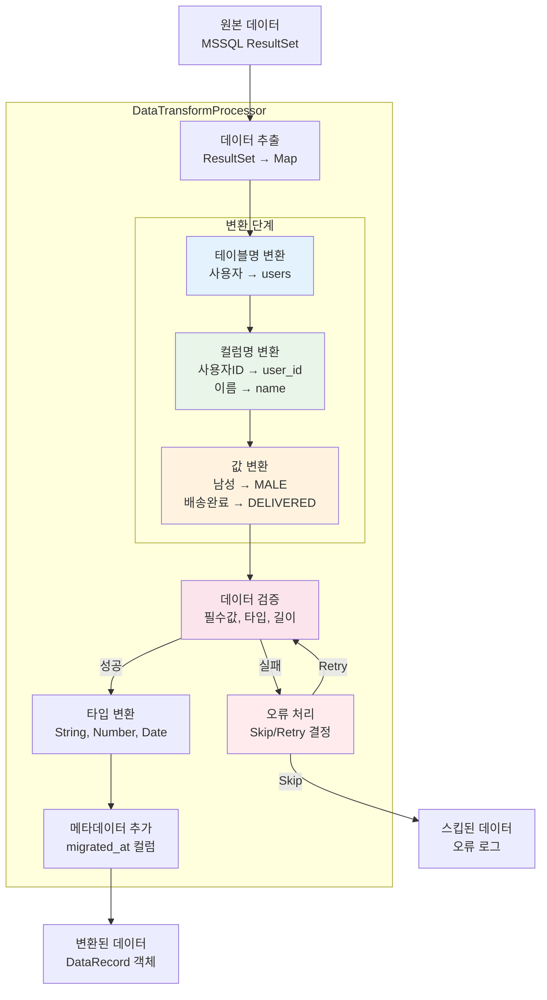
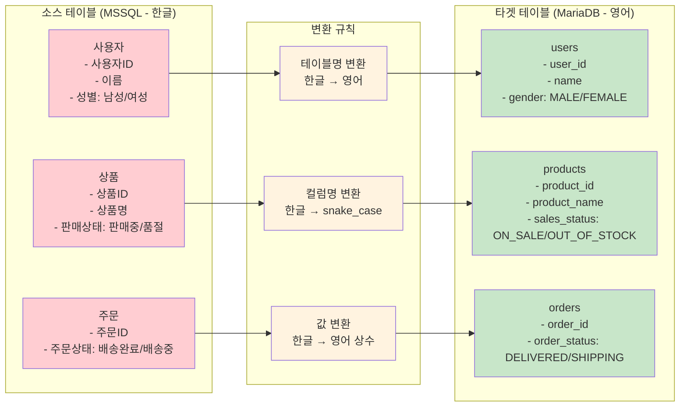
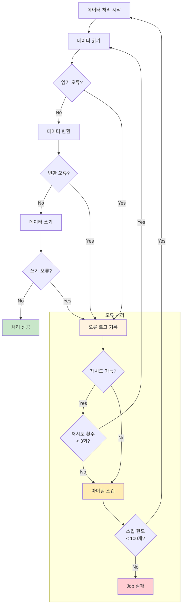
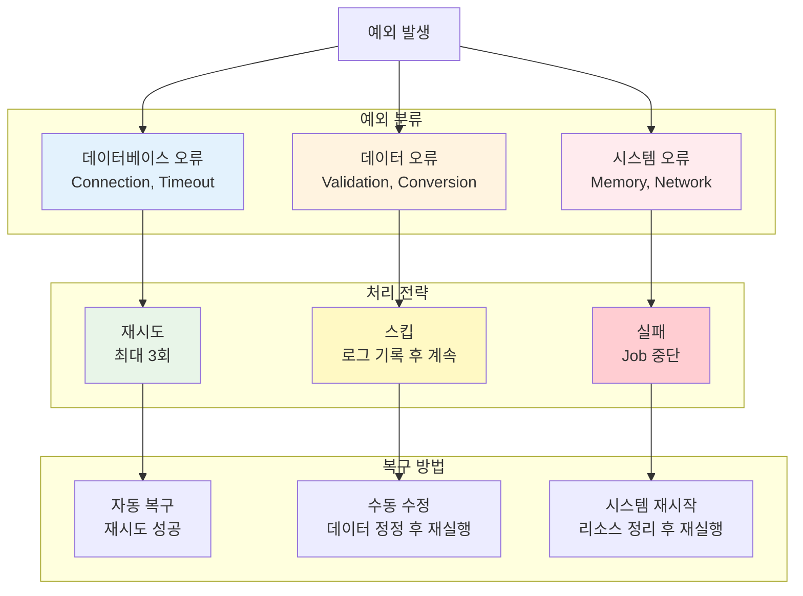
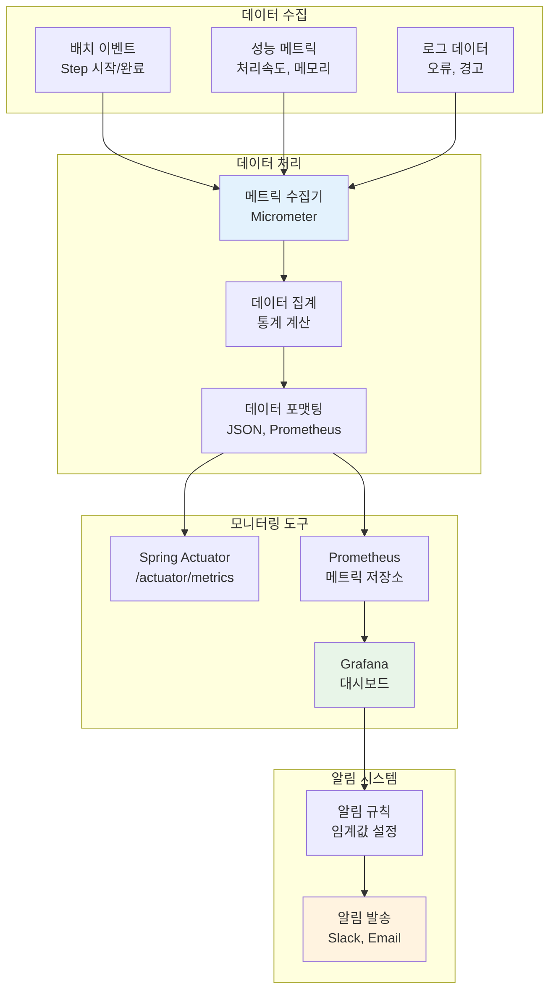

# 데이터 이관 프로세스 다이어그램

## 📋 문서 정보
- **프로젝트명**: MSSQL to MariaDB 데이터 이관 시스템
- **문서 유형**: 프로세스 다이어그램
- **작성일**: 2024-07-16
- **작성자**: SI 개발팀

## 🎯 1. 전체 시스템 프로세스 플로우

### 1.1 시스템 개요 다이어그램

## 🔄 2. 배치 실행 프로세스

### 2.1 전체 배치 실행 플로우

### 2.2 단일 테이블 이관 프로세스

## 📊 3. 데이터 변환 프로세스

### 3.1 데이터 변환 상세 플로우

### 3.2 테이블별 변환 매핑

## 🔧 4. 오류 처리 프로세스

### 4.1 오류 처리 플로우

### 4.2 예외 유형별 처리 전략

## 📈 5. 모니터링 프로세스

### 5.1 실시간 모니터링 플로우

이 프로세스 다이어그램은 SI 프로젝트에서 시스템의 전체적인 흐름과 각 단계별 처리 과정을 명확하게 보여줍니다.
